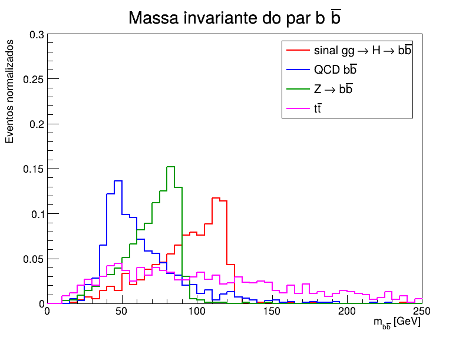

# F056 - Tarefa: Geradores de Eventos (Parte A - Higgs no PYTHIA8)

Escolhi a Parte A. Simulei 1000 eventos de gg -> H -> b bbar com mH = 125 GeV e 1000 eventos de cada
background (QCD bb, Z -> bb, ttbar), tudo no PYTHIA8 a 13 TeV.

Usei o Pythia 8.312 e o ROOT 6.40 do ambiente conda `rootenv`.

## Arquivos

- `main_higgs.cmnd` - card do sinal
- `bkg_qcd.cmnd`, `bkg_z.cmnd`, `bkg_ttbar.cmnd` - cards dos backgrounds
- `main_higgs.cc` - roda o pythia com o card que passar e salva a TTree `events`
- `Makefile`
- `plot_mass.C` - macro que faz as figuras
- `higgs_mass.root`, `bkg_qcd.root`, `bkg_z.root`, `bkg_ttbar.root` - saídas
- `massa_sinal_bkg.png` - massa bb do sinal e backgrounds sobrepostos
- `massa_higgs.png` - massa das filhas diretas do Higgs

## Como rodar

```
conda activate rootenv     # precisa, senao o pythia nao acha o PYTHIA8DATA (xmldoc)
make
make run                   # gera os 4 .root (demora uns 30 s)
make plot                  # gera as figuras
```

Ou um por vez: `./main_higgs main_higgs.cmnd higgs_mass.root`.

## Branches da TTree `events`

- `mH`: massa invariante das duas filhas diretas do Higgs (`event[i].mother1() == iHiggs`), como pede o
  enunciado. Só tem sentido no sinal, nos backgrounds fica -1.
- `mbb`: massa invariante do b e do bbar de maior pT no estado final. Esse é o que dá pra comparar
  entre sinal e background, porque os backgrounds não tem Higgs.
- `bPt`, `bbarPt`, `bEta`, `bbarEta`

## Escolhas

**Produção:** só `HiggsSM:gg2H`, fusão de glúons, que é o canal dominante no LHC (~87% da seção de choque a 13 TeV).
VBF, VH e ttH são bem menores, então deixei desligado.

**Decaimento:** H -> b bbar, que é o de maior branching ratio (~58%) pra mH = 125 GeV. O problema é que
tem muito background de QCD, mas como aqui é nível de gerador dá pra ver bem.

**PDF:** o enunciado pede `LHAPDF6:cteq6l1`, mas meu pythia não tem LHAPDF. O pythia já tem o CTEQ6L1 interno,
que é o `PDF:pSet = 8` (conferi no `PDFSelection.xml`), então usei esse. É o mesmo conjunto (LO, alpha_s(MZ) = 0.130),
então não deve mudar nada importante, só que não dá pra usar as variações de incerteza que o LHAPDF teria.
O default do pythia 8.3 seria o NNPDF2.3 QCD+QED LO (pSet 13).

**Hadronização desligada** (`HadronLevel:all = off`), igual o exemplo de aula, pra os b aparecerem como partícula final
e não precisar reconstruir jato. O parton shower continua ligado.

## Resultados

Seção de choque que o pythia deu (`sigmaGen`, LO):

| processo | eventos salvos | sigma (pb) | < mbb > (GeV) | fração com 100 < mbb < 130 |
|---|---|---|---|---|
| gg -> H -> bb | 1000 | 15.2 | 92.5 | 0.45 |
| QCD bb (pTHat > 20) | 1000 | 3.0e6 | 65.3 | 0.06 |
| Z -> bb | 1000 | 6.95e3 | 69.1 | 0.007 |
| ttbar | 996 | 464 | 119.0 | 0.16 |

No ttbar 4 eventos não tinham b e bbar no estado final e foram descartados.



(os histogramas estão normalizados pela área, então dá pra ver só a forma. Se fosse pela seção de choque
o QCD ficaria umas 10^5 vezes maior que o sinal e ia esconder tudo)

- `mH` das filhas diretas dá exatamente 125 GeV (`massa_higgs.png`), só com a largura do Higgs que é bem pequena.
- `mbb` do sinal tem pico um pouco abaixo de 125 (~110-120) e uma cauda pra baixo. Isso é porque os b irradiam
  glúons no shower (FSR) e perdem energia, e também às vezes pega o b errado de um g -> bb.
- Z -> bb tem pico perto de 91 GeV, bem perto do Higgs, e por isso ele serve pra calibrar a escala de massa.
- QCD bb fica em massa baixa (pico ~45 GeV, que vem do corte de pTHat > 20 GeV), mas como a seção de choque é enorme ainda
  domina na região do Higgs.
- ttbar é bem largo porque os dois b vem de tops diferentes, não tem ressonância, e ele tem bastante evento na janela de 100-130.
